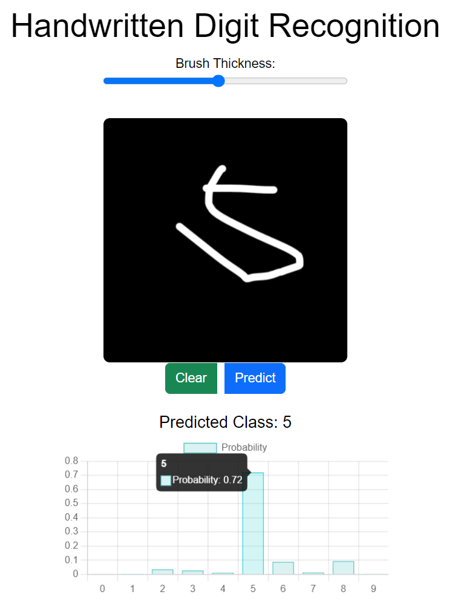
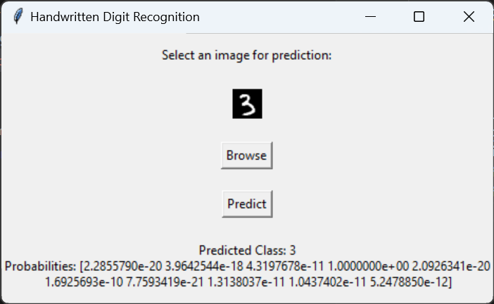

# ChatGPT-Handwritten Digit Recognition

This is a simple project for handwritten digit recognition using PyTorch. It includes a training script, an inference script with a graphical user interface (GUI), and a web page.
---
*All the contents including the README are written by ChatGPT 3.5.*

## Demo

### Web Demo



### GUI Demo



## Project Structure

The project is organized as follows:

- `dataset.py`: Script for loading and visualizing the handwritten digit dataset.
- `model.py`: Definition of the simple neural network model for digit recognition.
- `train.py`: Script for training the model, including dataset loading, training, validation, and testing.
- `inference_cli.py`: Script for loading the trained model and making predictions.
- `inference_gui.py`: GUI application for selecting and predicting handwritten digit images.
- `inference_web.py`: Web application for selecting and predicting handwritten digit images.

## Requirements

Make sure you have the following dependencies installed:

- Python 3.x
- PyTorch
- torchvision
- Pillow
- matplotlib

Install the dependencies using:

```bash
pip install torch torchvision Pillow matplotlib flask
```

or

```bash
pip install -r requirements.txt
```

## Dataset

The dataset used for this project is the [MNIST](http://yann.lecun.com/exdb/mnist/) dataset. It contains 60,000 training images and 10,000 testing images of handwritten digits. The images are grayscale and have a size of 28x28 pixels.

You can download the dataset from [here](mnist.7z) and then unzip it.

## Usage

### 1. Training the Model

To train the model, run:

```bash
python train.py
```

This will train the model on the handwritten digit dataset, save the best model, and display the validation accuracy.

---

Here is an example of the output of the training script for 10 epochs:

```bash
Epoch 1/10, Validation Accuracy: 0.9811428571428571
Epoch 2/10, Validation Accuracy: 0.9831428571428571
Epoch 3/10, Validation Accuracy: 0.9854285714285714
Epoch 4/10, Validation Accuracy: 0.9831428571428571
Epoch 5/10, Validation Accuracy: 0.9877142857142858
Epoch 6/10, Validation Accuracy: 0.9868571428571429
Epoch 7/10, Validation Accuracy: 0.9892857142857143
Epoch 8/10, Validation Accuracy: 0.988
Epoch 9/10, Validation Accuracy: 0.9874285714285714
Epoch 10/10, Validation Accuracy: 0.9867142857142858
Test Accuracy: 0.9911428571428571
```

### 2. CLI Inference Application

To run the CLI application for handwritten digit recognition, execute:

```bash
python inference_cli.py
```

### 3. GUI Inference Application

To run the GUI application for handwritten digit recognition, execute:

```bash
python inference_gui.py
```

This will create an executable file in the dist directory. Run the executable to use the GUI.

### 4. Web Inference Application

To run the web application for handwritten digit recognition, execute:

```bash
python inference_web.py
```

This will create a web page in the localhost `http://127.0.0.1:5000/`. Open the web page to use the web application.
